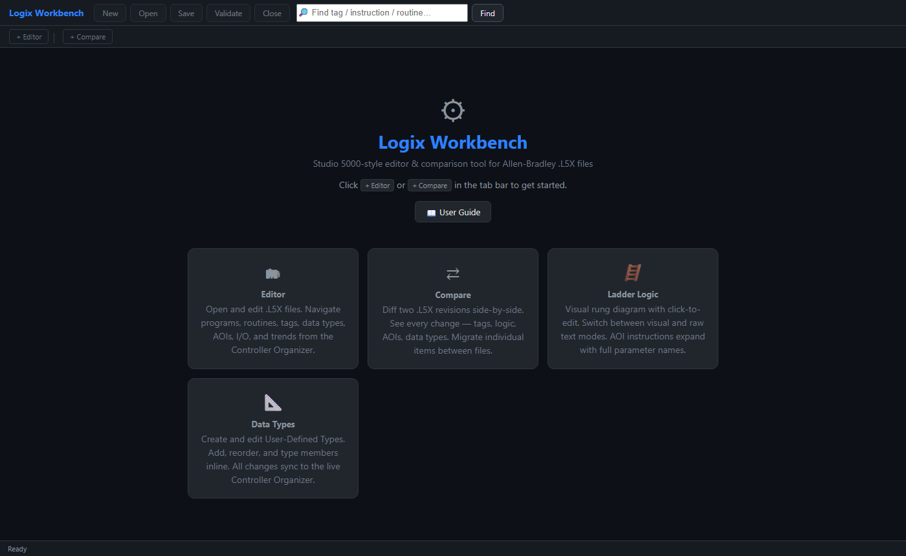
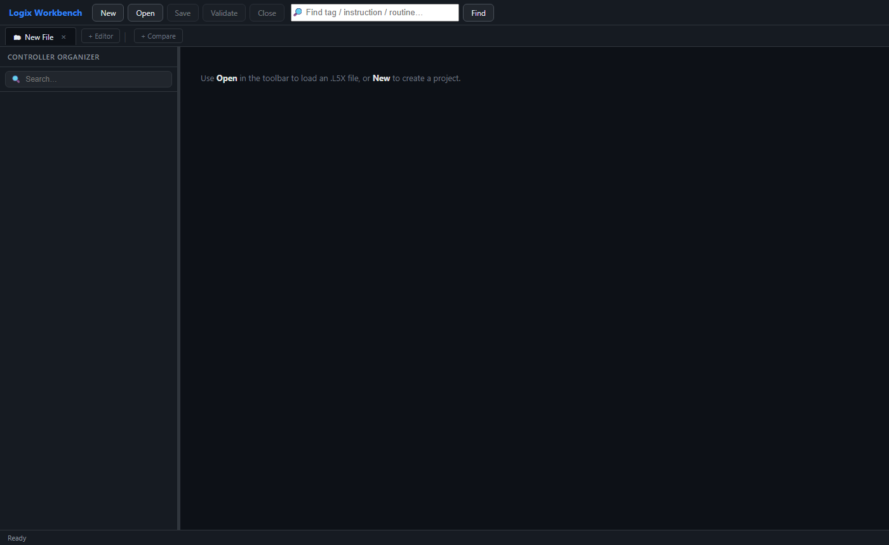
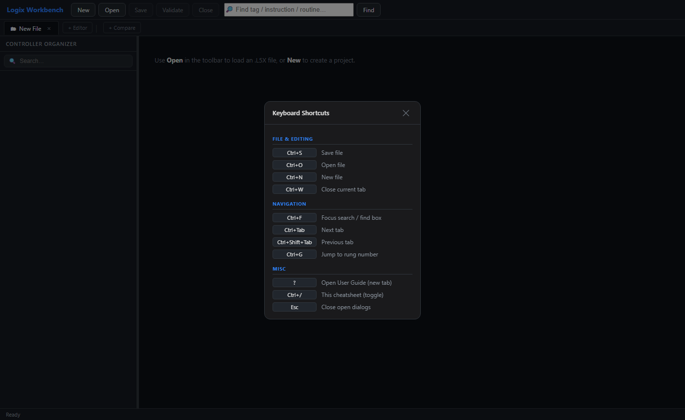
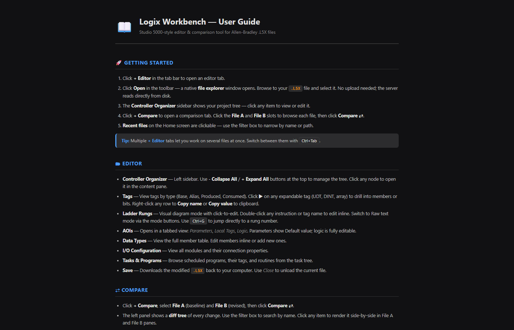

<div align="center">

# Logix Workbench
**Studio 5000-style editor and diff tool for Allen-Bradley `.L5X` files**

[](https://github.com/ChrisMangin/logix-workbench)
[](https://github.com/ChrisMangin/logix-workbench)
[](https://github.com/ChrisMangin/logix-workbench/releases/latest)
[](LICENSE)

<br>

</div>


Logix Workbench is a **standalone Windows app** (no Studio 5000 license required) that lets you open, edit, and diff Rockwell Automation `.L5X` controller export files directly in your browser — with a clean dark UI, visual ladder diagram rendering, and a full side-by-side comparison engine.

> **v1.1.0** — Rewritten in Rust. **2.2 MB** single EXE, instant startup, no Python or runtime dependencies.


## Screenshots

<table>
<tr>
  <td></td>
  <td></td>
</tr>
<tr>
  <td align="center"><em>Home screen with feature cards and recent files</em></td>
  <td align="center"><em>Editor with Controller Organizer sidebar</em></td>
</tr>
<tr>
  <td></td>
  <td></td>
</tr>
<tr>
  <td align="center"><em>Keyboard shortcut cheatsheet (Ctrl+/)</em></td>
  <td align="center"><em>Built-in User Guide (opens in new tab)</em></td>
</tr>
</table>


## Features

### Editor
- **Open any `.L5X` file** via native Windows file picker — reads directly from disk, nothing uploaded
- **Controller Organizer** sidebar with collapse/expand all — navigate programs, routines, tags, data types, AOIs, I/O, tasks, and trends
- **Visual Ladder Diagram** — renders rungs as graphical diagrams with click-to-edit; switch to Raw Text mode any time
- **Tags** — full CRUD for controller and program-scoped tags; drill into UDT/array members and individual DINT bits; right-click to copy name or value
- **AOI Editor** — tabbed view of Parameters, Local Tags, and Logic with full inline editing
- **Data Types** — view and edit UDT member tables inline
- **I/O Configuration**, **Tasks**, and **Trends** panels
- **Multiple editor tabs** — work on several files at once; `Ctrl+Tab` to cycle
- **Save** downloads the modified `.L5X` back to disk; unsaved-change indicator on every tab

### Compare
- **Side-by-side diff** of any two `.L5X` files — tags, routines, AOIs, data types, programs, I/O, and trends
- **Diff tree** with change counts; filter by name; click any item to render it in A/B panes
- **Rung-level diff** — Myers LCS algorithm detects changed rung content even when rung counts are identical; counts each logical change exactly once
- **Find in diff** — search rung text, tag names, and routine names; navigates to the exact rung in the correct panel
- **Migrate** — copy any item (tag, routine, AOI, data type) from one file to the other with one click
- **Copy Diff** — one click copies a plain-text summary of all changes to clipboard
- Visual / Raw Text toggle for all rung cards without rerunning the comparison

### Quality of Life
- **Keyboard shortcuts** — `Ctrl+S/O/N/W/F/G/Tab` plus `?` and `Ctrl+/` cheatsheet
- **Recent files** on the home screen with live filter
- **Jump to rung** (`Ctrl+G`) — scroll directly to any rung by number
- **User Guide** opens in a separate browser tab (`?` key)
- Runs **100% locally** — nothing is sent over the internet


## Quick Start

### Option 1 — Standalone EXE (Windows, no install needed)

1. Download **`L5XEditor.exe`** from the [latest release](https://github.com/ChrisMangin/logix-workbench/releases/latest)
2. Double-click it — a browser tab opens automatically at `http://127.0.0.1:5000`
3. Click **+ Editor**, then **Open** to load your `.L5X` file

The server auto-exits when the last browser tab is closed.

### Option 2 — Build from Source

Requires [Rust](https://rustup.rs/) 1.70+.

```sh
git clone https://github.com/ChrisMangin/logix-workbench
cd logix-workbench
cargo build --release
# EXE at: target/release/L5XEditor.exe
```


## Keyboard Shortcuts

| Shortcut | Action |
|----------|--------|
| `Ctrl+S` | Save file |
| `Ctrl+O` | Open file |
| `Ctrl+N` | New file |
| `Ctrl+W` | Close current tab |
| `Ctrl+F` | Focus search box |
| `Ctrl+Tab` | Next tab |
| `Ctrl+Shift+Tab` | Previous tab |
| `Ctrl+G` | Jump to rung number |
| `Ctrl+/` | Keyboard shortcut cheatsheet (toggle) |
| `?` | Open User Guide in new tab |
| `Esc` | Close open dialogs |


## Project Layout

```
logix-workbench/
├── Cargo.toml
├── src/
│   ├── main.rs              axum HTTP server, port detection, heartbeat watchdog
│   ├── state.rs             thread-safe app state (doc, compare cache)
│   ├── l5x/
│   │   ├── mod.rs           XML helpers — parse, serialize, navigate, mutate
│   │   ├── read.rs          read-only queries (summary, tags, routines, AOIs …)
│   │   ├── write.rs         mutations (add/edit/delete for all element types)
│   │   └── diff.rs          compare engine + migrate (Myers LCS, roxmltree)
│   └── api/
│       ├── static_files.rs  embedded frontend (rust-embed)
│       ├── project.rs       open/save/new/pick-file endpoints
│       ├── tags.rs          tag CRUD
│       ├── routines.rs      routine CRUD
│       ├── rungs.rs         rung add/edit/delete/move
│       ├── compare.rs       compare + migrate endpoints
│       └── …                datatypes, aois, modules, tasks, trends, misc
├── frontend/
│   ├── index.html
│   ├── style.css
│   ├── app.js               UI logic (~5 000 lines, no build step)
│   ├── ladder.js            visual ladder diagram renderer
│   └── guide.html           standalone user guide page
└── docs/
    └── screenshots/
```


## Tech Stack

| Layer | Technology |
|-------|-----------|
| HTTP server | [axum](https://github.com/tokio-rs/axum) + tokio |
| XML parsing (reads) | [roxmltree](https://github.com/RazrFalcon/roxmltree) — zero-copy |
| XML mutation (writes) | [xmltree](https://github.com/eminence/xmltree-rs) |
| Rung diff | [similar](https://github.com/mitsuhiko/similar) — Myers LCS |
| Frontend embedding | [rust-embed](https://github.com/pyros2097/rust-embed) |
| File dialogs | [rfd](https://github.com/PolyMeilex/rfd) — native Win32 |
| Frontend | Vanilla HTML / CSS / JS — no framework, no build step |


## License

MIT — see [LICENSE](LICENSE).
